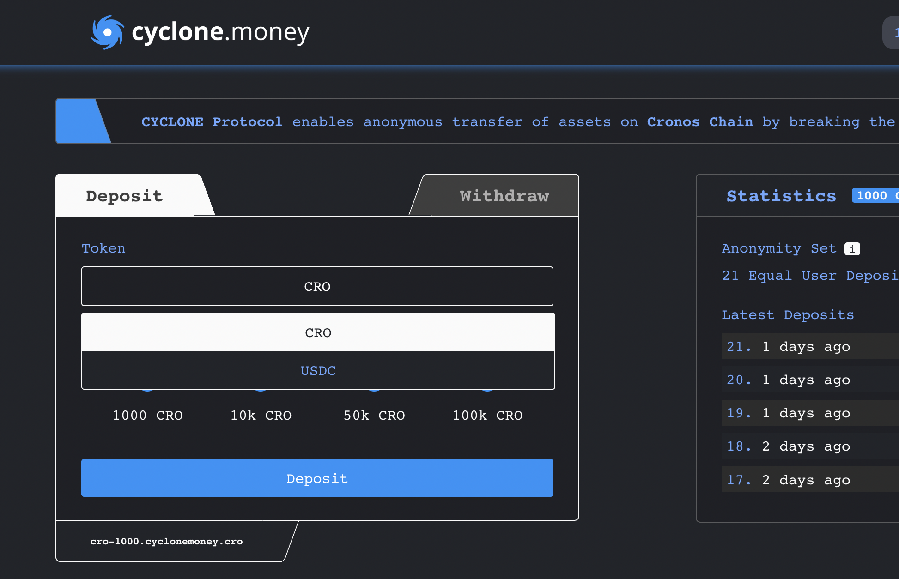
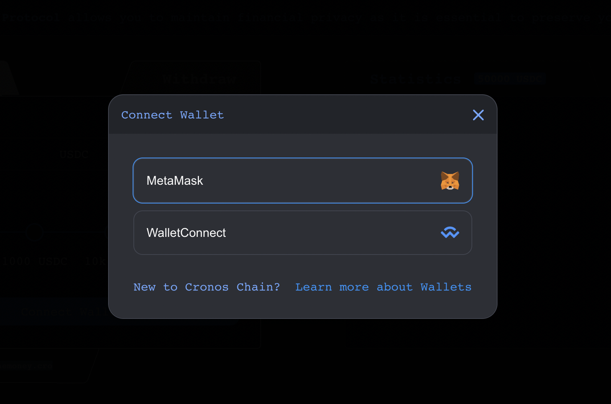
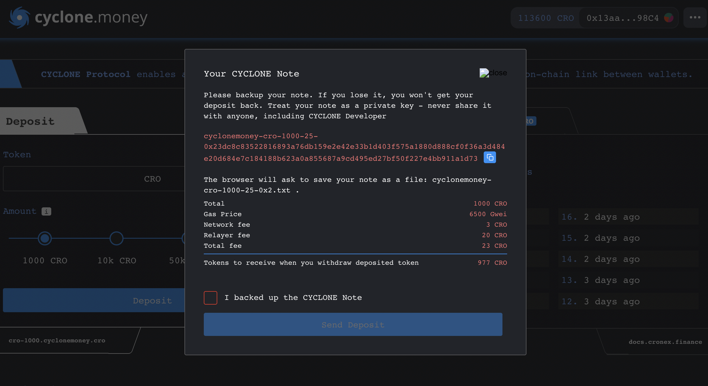

# Depositing & Withdrawing

This tutorial is a step-by-step explanation of how to deposit & withdraw your funds. If you want to understand how the internal system of **CYCLONE Money** works, please [refer to this page](how-does-cyclone-work.md).

## **Depositing into CYCLONE Money**

### Connect to CYCLONE

**CYCLONE Money** is available only on the Cronos Chain for now, so you will have to [setup your wallet on the Cronos Chain](../introduction/setup-metamask-wallet.md) and visit the website.

### Select a token

Choose the token you want to deposit and its amount. Currently **CYCLONE Money** supports both CRO & USDC. More tokens will be added in the future.

### Connect your wallet

Click on `Connect` and choose between wallet providers such as Metamask or WalletConnect.

### Save your Note

Click on `Deposit` and store your note on a secure place before clicking on `I backed up the CYCLONE note`. You can also view your deposits in the Deposit History at the bottom.

### Be patient

As explained [here](improving-privacy-on-cyclone.md), the longer you wait, the greater your anonymity set will be.

Congrats ! You did it. Now your tokens are on the **CYCLONE Money** pool. You can now wait to improve your anonymity and share the note if you wish to transfer the assets to someone else.

## Withdrawing from CYCLONE Money

### Paste your CYCLONE Note

Use your deposit note by pasting it in the corresponding box. Click on `Withdraw` and wait for the zk-Snark proof to be generated. Enter the recipient address and wait for the relayer to withdraw the funds into the specified wallet.


The receiving wallet need not hold any CRO as the relayer is funding the transaction.


### Confirm the Withdrawal

Done !
