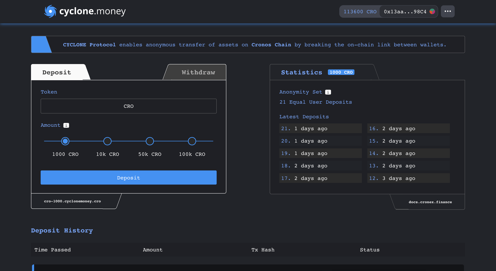

# Improving Privacy on CYCLONE

The **CYCLONE Money** tool allows you to remain anonymous on-chain. However, if the tool is used without protecting oneself upstream and downstream, there is no point and the anonymity would only be partial. There are practices to avoid this.

### Use TOR and/or a VPN

Your internet service provider (ISP) identifies you with an IP address. To prevent third parties from knowing that you are using **CYCLONE Money**, you should consider using TOR and/or a VPN for your transfers. Avoid using free VPNs, they tend to keep or even sell your data. There are several VPNs on the market boasting a "no-log policy".

### Save your note in a safe place 

Your note provides a record of your original transaction. Anyone who has it can withdraw the funds deposited, but also know the deposit address. Be sure to keep this note away from prying eyes and store it in a secure environment.

### Delete data 

Your browser is a real source of information for the extensions you use. Delete your data after each deposit or withdrawal. If two transfers are made with the same cookies, the extension you are using will be able to link these two transactions.

### Be patient 

Your anonymity also depends on the number of transactions after your deposit (cf. Statistics tab above). If you withdraw your funds immediately after depositing them, it is possible to link your deposit to your transfer using correlation probabilities. The longer you wait, the greater your anonymity set will be.

### Use multiple addresses

A 7 x 1000 CRO deposit from one address and a 7 x 1000 CRO withdrawal to a single address can also be linked. Remember to multiply your withdrawal addresses.
